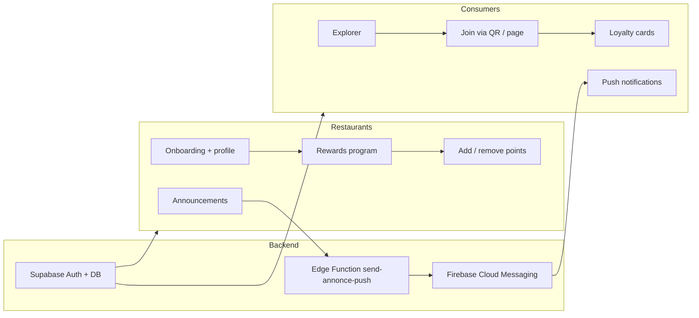

# Fidelo

**Fidelo** is a Progressive Web App (PWA) that connects restaurants and customers through simple digital loyalty programs. Restaurants create rewards, add or remove points, and send announcements; customers discover partners, join programs with a QR code, track their points, and receive push notifications.

---

## Idea

Many small restaurants still rely on paper stamp cards. Fidelo digitizes that experience:

| For restaurants | For customers |
|-----------------|---------------|
| Create a loyalty program in minutes | Discover restaurants in Explorer |
| Add or remove points after a visit or reward use | Join via QR code or restaurant page |
| Send announcements with push notifications | See cards, points, and rewards in one place |
| Appear in the public Explorer (organic visibility) | Get notified when a partner posts news |
| Completely free | Stay signed in across sessions |

A public landing page (`/pour-restaurateurs`) presents these benefits and links to restaurateur signup. Admins validate new or updated restaurant profiles before they appear in Explorer.

---

## How it works



### Consumer flow

1. Sign up / sign in (`/connexion/consommateur`) — email or Google.
2. Browse validated restaurants in **Explorer** (search + city filter).
3. Open a restaurant page (from Explorer or by scanning the restaurateur QR code).
4. Join the loyalty program → a row is created in `cartes`.
5. View cards, points, rewards, and restaurant photos on **Mes cartes**.
6. Receive push notifications when a partner sends an announcement (token stored in `fcm_tokens`, one token per user).

### Restaurateur flow

1. Sign up / sign in (`/connexion/restaurateur`).
2. Complete **onboarding** (name, address, city, website).
3. Manage **profile** (logo, photos, address, city, website) — changes go back to “pending” until an admin validates them.
4. Build the **rewards program** and send **announcements**.
5. **Add or remove points** by scanning the customer QR code or entering their ID.
6. Show the restaurant QR code so customers can open the public restaurant page and join.

### Admin flow

1. Access `/admin` (admin-only).
2. Review restaurants with status `en_attente`.
3. Validate (copy draft fields to `published_*` and set `statut = valide`) or reject.
4. Share the presentation page via a QR code pointing to `/pour-restaurateurs`.

### Announcements & push

1. Restaurateur creates an announcement (stored in `annonces`).
2. The app calls the Supabase Edge Function `send-annonce-push`.
3. The function loads subscribers (`cartes`), their FCM tokens (`fcm_tokens`), and sends push via Firebase Cloud Messaging.
4. Customers see the announcement on `/client/annonces` and receive a notification when the app is in the background.

---

## Main routes

| Path | Audience | Description |
|------|----------|-------------|
| `/` | Everyone | Home — choose Restaurateur or Consommateur |
| `/pour-restaurateurs` | Public | Presentation page (benefits + signup CTA) |
| `/connexion/consommateur` | Consumers | Sign in / sign up |
| `/connexion/restaurateur` | Restaurants | Sign in / sign up |
| `/client/explorer` | Consumers | Discover restaurants (search + city) |
| `/client/cartes` | Consumers | Loyalty cards & detail |
| `/client/annonces` | Consumers | Announcements from subscribed restaurants |
| `/client/profil` | Consumers | Profile, QR code, notification toggle |
| `/client/restaurant/[id]` | Public / consumers | Restaurant page after QR scan |
| `/dashboard/onboarding` | Restaurants | First-time profile setup |
| `/dashboard/programme` | Restaurants | Rewards + send announcement |
| `/dashboard/annonces` | Restaurants | Announcement history (delete supported) |
| `/dashboard/ajouter-points` | Restaurants | Add or remove points |
| `/dashboard/profil` | Restaurants | Profile, photos, restaurant QR |
| `/admin` | Admins | Validation queue + presentation QR |

---

## Tech stack

- **Next.js 16** (App Router) + **React 19** + **TypeScript**
- **Tailwind CSS 4**
- **Supabase** — Auth, PostgreSQL, RLS, Storage, Edge Functions
- **Firebase Cloud Messaging** — web push notifications
- **@ducanh2912/next-pwa** — PWA (manifest, service worker)
- **qrcode.react** — QR codes for customers and restaurants

---

## Project structure (high level)

```
src/app/
  (client)/          # Consumer space (layout + bottom nav)
  (dashboard)/       # Restaurateur dashboard (layout + bottom nav)
  admin/             # Admin validation UI
  connexion/         # Auth pages
  pour-restaurateurs/# Public marketing page
  auth/callback/     # OAuth callback
src/lib/
  supabase.ts        # Supabase client + storage helpers
  firebase.ts        # Firebase app init
  villes.ts          # City list (Bruxelles, Liège, …)
supabase/
  migrations/        # SQL migrations
  functions/         # Edge Functions (e.g. send-annonce-push)
public/
  icons/             # PWA icons
  firebase-messaging-sw.js
```

---

## Prerequisites

- **Node.js** 20.9 or higher
- A **Supabase** project (URL + anon key; service role for Edge Functions)
- A **Firebase** project (web app config + VAPID key + service account for FCM)

---

## Setup

### 1. Install dependencies

```bash
npm install
```

### 2. Environment variables

Create `.env.local` (and mirror the same keys on Vercel for production):

```env
NEXT_PUBLIC_SUPABASE_URL=
NEXT_PUBLIC_SUPABASE_ANON_KEY=
NEXT_PUBLIC_APP_URL=          # e.g. https://your-app.vercel.app

NEXT_PUBLIC_FIREBASE_API_KEY=
NEXT_PUBLIC_FIREBASE_AUTH_DOMAIN=
NEXT_PUBLIC_FIREBASE_PROJECT_ID=
NEXT_PUBLIC_FIREBASE_STORAGE_BUCKET=
NEXT_PUBLIC_FIREBASE_MESSAGING_SENDER_ID=
NEXT_PUBLIC_FIREBASE_APP_ID=
NEXT_PUBLIC_FIREBASE_MEASUREMENT_ID=
NEXT_PUBLIC_FIREBASE_VAPID_KEY=
```

Edge Function secrets (Supabase):

- `FIREBASE_SERVICE_ACCOUNT_JSON` — Firebase service account JSON
- Deploy with JWT verification disabled if you authenticate inside the function:

```bash
supabase functions deploy send-annonce-push --no-verify-jwt
```

### 3. Database

Apply migrations under `supabase/migrations/` (SQL Editor or Supabase CLI), including tables such as `restaurateurs`, `cartes`, `annonces`, `recompenses`, `fcm_tokens`, and admin/validation columns.

### 4. Run locally

```bash
npm run dev
```

Open [http://localhost:3000](http://localhost:3000).

---

## Scripts

| Script | Command | Description |
|--------|---------|-------------|
| `dev` | `npm run dev` | Development server |
| `build` | `npm run build` | Production build |
| `start` | `npm run start` | Run production server |
| `lint` | `npm run lint` | ESLint |

---

## Deployment notes

- Frontend is typically hosted on **Vercel**; set all `NEXT_PUBLIC_*` variables for build and runtime.
- Configure Supabase Auth **Site URL** and **Redirect URLs** to your production domain (not `localhost`).
- Use the **anon** key in the browser (`NEXT_PUBLIC_SUPABASE_ANON_KEY`), never the service role key.
- Push notifications require HTTPS, a configured VAPID key, and `firebase-messaging-sw.js` in `public/`.

---

## License / status

Private project (`"private": true` in `package.json`). Product and features continue to evolve.
